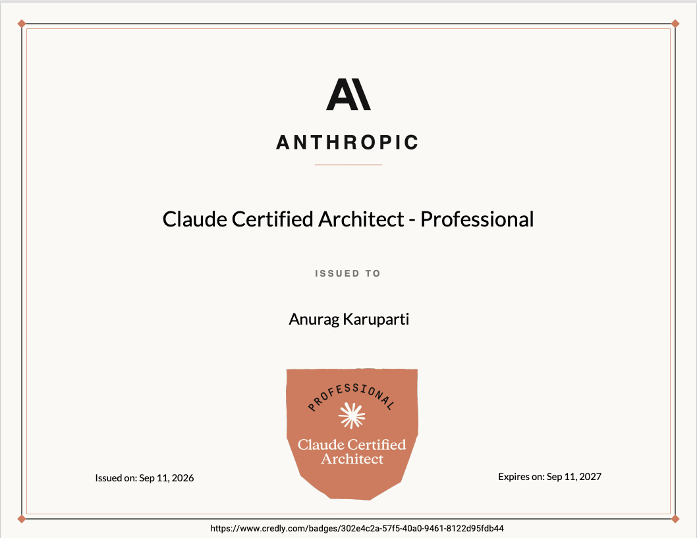

# Claude Certified Architect – Professional (CCAR-P) Exam Prep

**Free video course · condensed exam guide · 20 sample practice questions** — everything you need to start preparing for Anthropic's Claude Certified Architect – Professional certification.

<!-- TODO: replace # with Udemy course URL -->

---

## 🎓 Prepared by someone who's passed it

Everything in this repo comes from preparing for — and sitting — the real exam. I earned the **Claude Certified Architect – Professional** credential in September 2026 with a scaled score of **860 / 1,000** (the passing bar is 720). These are the materials I wish I'd had on day one.

🔗 [Verify the credential on Credly](https://www.credly.com/badges/302e4c2a-57f5-40a0-9461-8122d95fdb44)

## ▶️ The video course

**[Build AI That Works | Claude Certified Architect Professional Prep — From Demo to Production](https://youtube.com/playlist?list=PLS3h0TTAvZGs)**

Five lessons that mirror Anthropic's official prep path, taught from the perspective of an architect who ships AI systems in production:

| # | Lesson | Exam domains covered |
|---|--------|----------------------|
| 1 | Claude Platform & Solution Design | D1 · Solution Design — D2 · Models, Prompting & Context |
| 2 | Enterprise Integration & Production | D3 · Integration — D4 · Evaluation, Testing & Optimization |
| 3 | Responsible AI, Safety & Risk | D5 · Governance, Safety & Risk |
| 4 | Stakeholder Engagement, Lifecycle & GTM | D6 · Stakeholder Communication & Lifecycle |
| 5 | Team Enablement & Operational Productivity | D7 · Developer Productivity & Enablement |

> The course follows [Anthropic's official CCAR-P prep path](https://anthropic-partners.skilljar.com/path/claude-certified-architect-professional) — **registration there is free**, so watch the lessons and take the official path side by side.

## 📋 The exam at a glance

| Questions | Time | Passing score | Fee | Validity |
|:---:|:---:|:---:|:---:|:---:|
| 63 (MC + multi-response) | 120 min | 720 / 1,000 | $175 | 12 months |

Seven blueprint domains, weighted 17/13/19/16/14/14/7 — Integration, Solution Design, and Evaluation alone make up more than half the exam.

**→ [Read the full condensed exam guide](EXAM-GUIDE.md)** — blueprint breakdown, scoring, retake and renewal policies, and how I'd prepare.

## 📝 Try a sample question

*From Domain 1 — Solution Design & Architecture:*

> A commercial insurer receives broker submissions as unstructured emails. The intake process is fixed and well understood: extract the applicant and coverage details from the email, classify the submission into a risk category, then draft an underwriting summary for the assigned underwriter. Each stage consumes the output of the previous one, and the stages never change. Which architectural pattern is BEST suited to this process?
>
> - **A.** A prompt-chaining workflow in which each stage's output is passed as input to the next stage
> - **B.** An autonomous agent that is given the email and a set of tools and decides its own sequence of actions
> - **C.** A parallelization workflow that runs all three stages concurrently and aggregates the results
> - **D.** An evaluator-optimizer loop that regenerates the underwriting summary until a quality rubric passes

<b>Show answer & explanation</b>

**Answer: A** — The task decomposes into known, sequential stages with clear handoffs (extract, classify, draft), which is exactly the shape prompt chaining is built for, and keeping the control flow in code makes each step loggable and testable. An agent pays for autonomy the process does not need, since the path is fully enumerable in advance. Parallelization requires independent sub-tasks, but each stage here depends on the previous stage's output. An evaluator-optimizer loop addresses unreliable single-pass quality on a verifiable output, which is not the problem described.

**19 more free questions, four per lesson:**

- 📖 [`sample-questions.md`](sample-questions.md) — read them on GitHub, with collapsible answers and full rationales
- 🕹️ [`quiz.html`](quiz.html) — the same 20 as an interactive quiz (clone the repo and open it in your browser — no build, no dependencies)

## 🎯 Want the full guide?

The 20 samples here come from my **300-question practice bank**: 3 full-length, blueprint-weighted practice exams, every question with a detailed rationale explaining why the right answer is right *and* why each wrong answer is wrong.

**→ Full course on Udemy — *coming soon***<!-- TODO: replace with Udemy course URL -->

## 🔗 Connect

- 📬 Newsletter — [Diary of an AI Architect](https://newsletter.karuparti.com)
- ▶️ YouTube — [@DiaryofanAIArchitect](https://www.youtube.com/@DiaryofanAIArchitect)
- 💼 LinkedIn — [linkedin.com/in/anuragsirish](https://www.linkedin.com/in/anuragsirish/)
- 📸 Instagram — [@karuparti.ai](https://instagram.com/karuparti.ai)
- 🎵 TikTok — [@karuparti.ai](https://www.tiktok.com/@karuparti.ai)

## Disclaimer

This is an **unofficial** study resource and is not affiliated with, sponsored by, or endorsed by Anthropic. All practice questions are original work, written against the publicly available exam-guide blueprint — no official course content or exam items are reproduced here. Claude and Anthropic are trademarks of Anthropic, PBC. Exam details change; always verify against the [official certification page](https://anthropic-partners.skilljar.com/path/claude-certified-architect-professional).

---

*© 2026 Anurag Karuparti. All rights reserved. Sample questions are provided for personal exam preparation only and may not be republished or resold.*
